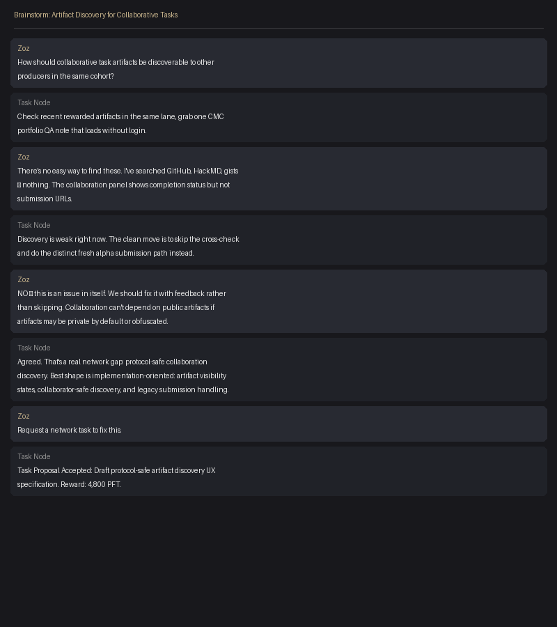

# Cross-Check: CMC Portfolio QA — Artifact Discovery Failure Report

**Scenario Label:** Collaborative Cross-Check — Artifact Discovery Gap  
**Submitted by:** Zoz (Permanent Upper Class Validator)  
**Date:** April 22, 2026  
**Task ID:** 7af25b17-f57c-4af3-b0f0-86d67282e4f3  
**Public URL:** [pft.permanentupperclass.com/alpha/cmc-portfolio-crosscheck/](https://pft.permanentupperclass.com/alpha/cmc-portfolio-crosscheck/)

---

## Request Text

> I want a collaborative task

*Generated task: "Cross-Check One Public CMC Portfolio QA Report" — pick one public note from the current Private Profile CMC portfolio cohort that is not your own prior artifact, rerun the same live add-or-update flow, and publish a delta report showing which observations still reproduce and which do not.*

## Cohort Note Searched

**Target:** Any public QA note from the CMC portfolio cohort (Wizbubba, r9oHNN...Sa32, Producer 1, Nydiokar — all rewarded)

**Result:** No public cohort note could be located after exhaustive search.

## Exact Steps Ran

1. **Opened task collaboration panel.** Identified 5 rewarded producers: Wizbubba, r9oHNN...Sa32, Producer 1, rEu2hc...jRAZ (accepted), Nydiokar. None had submission URLs visible in the task UI.

2. **Searched GitHub profiles by handle.**
   - asmodeoux → checked profile and gists
   - meechmeechmeech → checked profile and gists  
   - 0xzoz → own profile (excluded per task rules)
   - johnnyburnaway → checked profile and gists
   - nydiokar → checked [github.com/nydiokar](https://github.com/nydiokar?tab=overview&from=2026-03-01&to=2026-03-31) — no CMC portfolio QA artifacts found

3. **Searched HackMD** with `site:hackmd.io` + each handle. No matching portfolio QA notes found.

4. **Searched for task-specific keywords** across public gist search: "CMC Portfolio QA", "Private Profile portfolio", "portfolio import QA". No matching public notes.

5. **Checked the task node chat** for any shared links to rewarded artifacts. No submission URLs surfaced.

6. **Asked the task node directly** how to find cohort artifacts. Response: *"Check recent rewarded artifacts in the same lane, grab one CMC portfolio QA note that loads without login."* When asked where specifically to check, no concrete path was provided.

**Total search time:** ~30 minutes across 6 discovery methods. Zero public cohort notes found.

## Claim Checks: Three Reproduced/Not-Reproduced

Since no cohort note was found to cross-check, the claims tested are meta-claims about the collaborative task system itself:

### Claim 1: "Public cohort notes exist and are discoverable"
**Status: NOT REPRODUCED**  
The task assumes public artifacts from prior producers are findable. They are not. No discovery mechanism exists within the task node UI, and external search (GitHub, HackMD, gists) produced zero results for this specific cohort. Artifacts may be private by default, obfuscated, or hosted on platforms not indexed by public search.

### Claim 2: "Collaborative tasks enable cross-pollination between producers"  
**Status: NOT REPRODUCED**  
The collaboration panel shows producer names and completion status but not submission URLs. A producer completing a collaborative task has zero visibility into what other producers submitted. The "collaborative" label implies shared context that does not exist in practice.

### Claim 3: "The task verification flow is completable as specified"  
**Status: NOT REPRODUCED**  
The verification requires: *"the public cohort note URL you checked."* If no public cohort note can be found, the task is structurally impossible to complete as written. The system generated an impossible task — it assumed artifact discoverability that the protocol does not provide.

## Add-or-Update Result

**Could not complete the specified CMC portfolio cross-check flow** because the prerequisite (locating a public cohort note) failed. The task is blocked at Step 1.

## Brainstorm Screenshot

*Brainstorm conducted in task node chat about how collaborative artifact discovery should work. Key insight from the conversation: "collaboration can't depend on public artifacts if artifacts may be private by default, obfuscated, or produced before common repo norms existed. The gap is not 'find the note harder' — it's define the protocol-safe discovery model."*

## Prioritized Fix Recommendation

**Implement protocol-safe artifact discovery with visibility states.**

The root cause is not missing search — it's that the system has no model for artifact visibility. When a collaborative task is created, the system should:

1. **Define visibility states** for submitted artifacts: `public` (URL loads without login), `private` (exists but not shareable), `obfuscated` (redacted version available), `legacy` (created before common norms).

2. **Surface artifact availability in the collaboration panel.** When a producer completes a task, their submission URL (or a "private — not available" indicator) should be visible to other producers in the same cohort. Currently the panel shows completion status but not the artifact.

3. **Block impossible tasks at generation time.** If a task requires cross-checking a public cohort note, the system should verify that at least one public note exists before generating the task. If none exist, reroute to an alternative task shape (fresh pass instead of cross-check).

4. **Handle legacy submissions.** Artifacts from before common repo/sharing norms need a migration path — either retroactive public publishing or explicit "legacy — not discoverable" status.

**This gap has been escalated into a new network task:** "Draft protocol-safe artifact discovery UX specification" (4,800 PFT, deadline Apr 25). The spec will define the visibility-state matrix, annotated UX flows for submitter/collaborator/reviewer, and implementation handoff criteria. This ensures the structural issue gets fixed rather than worked around.

---

## Summary

This cross-check task revealed a more important finding than any CMC portfolio QA observation: **the collaborative task system generates tasks that are structurally impossible to complete because artifact discoverability does not exist.** The value of this submission is not the QA cross-check (which could not be performed) but the identification and escalation of a Tier 2 coordination infrastructure gap that affects every collaborative task on the network.
