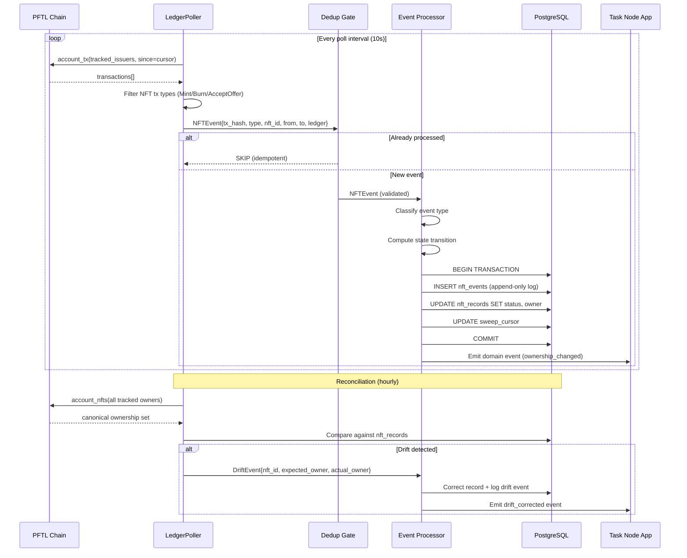
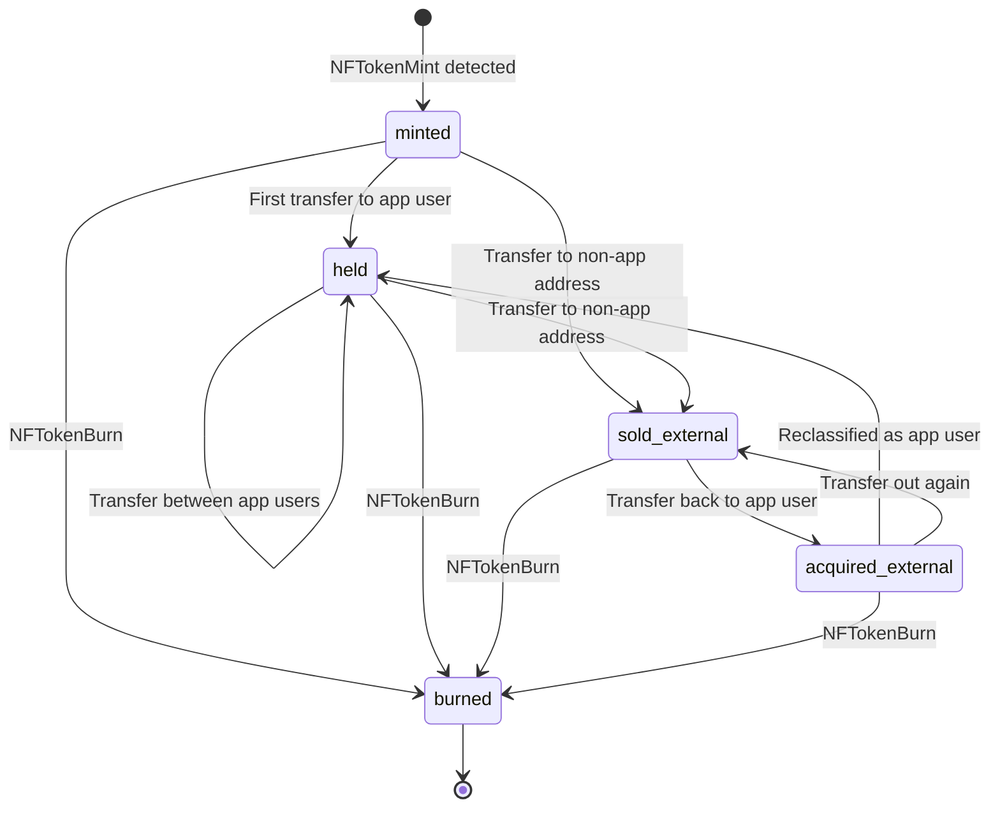

# NFT Ownership Sweeper — Architecture Package

## NestJS Backend Service for Post Fiat Task Node

**Version**: 1.0.0  
**Author**: Permanent Upper Class  
**Date**: 2026-04-16  
**Stack**: NestJS + TypeScript + XRPL/PFTL RPC + PostgreSQL

---

## 1. Target Audience and Use Cases

### Audience

| Stakeholder | Interest |
|-------------|----------|
| **Task Node operators** | Need accurate NFT ownership state to gate features, assign permissions, or verify holdings |
| **Platform developers** | Need a reliable event-driven service to sync off-app NFT transfers into the app's database |
| **Contributors** | Expect their NFT holdings (task badges, role tokens, achievement NFTs) to reflect correctly regardless of where the transfer happened |

### Use Cases

1. **Off-app sale detection**: A contributor sells a Task Node-issued NFT on an external marketplace or via a direct peer-to-peer `NFTokenAcceptOffer`. The sweeper detects the ownership change and updates the app's NFT status from `held` → `sold_external`.

2. **Incoming acquisition detection**: A user acquires a relevant NFT from an external source. The sweeper detects the new holder and creates or updates the app-side record to `acquired_external`.

3. **Burn detection**: An NFT is burned on-chain. The sweeper transitions the record to `burned` and prevents stale references.

4. **Mint detection**: A new NFT is minted by a tracked issuer. The sweeper creates an initial record in `minted` state.

5. **Periodic reconciliation**: A background job compares the app's NFT ownership table against the canonical on-chain state to catch any events missed by the real-time poller.

---

## 2. System Architecture

### 2.1 Component Overview

```
┌─────────────────────────────────────────────────────────────────────┐
│                        PFTL Chain (RPC Node)                        │
│                                                                     │
│   account_tx / subscribe / account_nfts / nft_info                  │
└───────────────┬───────────────────────────┬─────────────────────────┘
                │ poll / stream              │ on-demand query
                ▼                            ▼
┌───────────────────────────┐   ┌────────────────────────────────────┐
│   Ingestion Module        │   │   Reconciliation Module            │
│                           │   │                                    │
│   • LedgerPoller          │   │   • Full-state comparator          │
│   • WebSocket subscriber  │   │   • Drift detector                 │
│   • Raw tx → NFTEvent     │   │   • Runs on cron (hourly/daily)    │
│   • Deduplication gate    │   │                                    │
└──────────┬────────────────┘   └──────────────┬─────────────────────┘
           │ NFTEvent                           │ DriftReport
           ▼                                    ▼
┌─────────────────────────────────────────────────────────────────────┐
│                     Event Processor Module                          │
│                                                                     │
│   • Validate event (signature, ledger finality)                     │
│   • Classify: mint | transfer | burn | offer_created | offer_accepted│
│   • Compute state transition                                        │
│   • Idempotency check (event_hash dedup)                            │
│   • Apply transition to DB                                          │
│   • Emit domain event for downstream consumers                      │
└──────────┬──────────────────────────────────────────────────────────┘
           │
           ▼
┌─────────────────────────────────────────────────────────────────────┐
│                        PostgreSQL                                   │
│                                                                     │
│   nft_records   │   nft_events   │   sweep_cursor   │   nft_offers  │
└──────────┬──────────────────────────────────────────────────────────┘
           │ domain events
           ▼
┌─────────────────────────────────────────────────────────────────────┐
│                     Task Node Application                           │
│                                                                     │
│   • Feature gating (owns NFT → unlock feature)                      │
│   • Profile display (show held NFTs)                                 │
│   • Achievement verification                                        │
└─────────────────────────────────────────────────────────────────────┘
```

### 2.2 Event Flow (Mermaid)



---

## 3. TypeScript Interface Sketches

### 3.1 Core Domain Types

```typescript
// ─── NFT Identity ───────────────────────────────────────────────────

interface NFTokenId {
  /** XRPL NFToken ID (64 hex chars) */
  nft_id: string;
  /** Issuer XRPL address */
  issuer: string;
  /** NFT taxon (category grouping) */
  taxon: number;
  /** Serial number within the taxon */
  serial: number;
  /** Transfer fee in basis points (0-50000) */
  transfer_fee: number;
  /** Flags bitmask */
  flags: number;
}

// ─── NFT Event (from chain) ────────────────────────────────────────

type NFTEventType =
  | 'mint'           // NFTokenMint
  | 'burn'           // NFTokenBurn
  | 'transfer'       // NFTokenAcceptOffer (ownership changed)
  | 'offer_created'  // NFTokenCreateOffer (sell/buy offer posted)
  | 'offer_cancelled'; // NFTokenCancelOffer

interface NFTEvent {
  /** SHA-256 of (tx_hash + nft_id + event_type) for idempotency */
  event_hash: string;
  /** On-chain transaction hash */
  tx_hash: string;
  /** Ledger index where the event was validated */
  ledger_index: number;
  /** Ledger close time (ISO 8601) */
  ledger_time: string;
  /** Event classification */
  event_type: NFTEventType;
  /** The NFToken involved */
  nft_id: string;
  /** Previous owner (null for mint) */
  from_address: string | null;
  /** New owner (null for burn) */
  to_address: string | null;
  /** Amount paid in drops (0 for free transfers) */
  amount_drops: string;
  /** Whether this was detected via real-time poll or reconciliation */
  detection_source: 'poll' | 'reconciliation' | 'websocket';
  /** Raw transaction JSON for audit */
  raw_tx: Record<string, unknown>;
}

// ─── NFT Record (app-side state) ───────────────────────────────────

type NFTStatus =
  | 'minted'             // Just created, held by issuer
  | 'held'               // Held by a known app user
  | 'sold_external'      // Transferred out via off-app sale
  | 'acquired_external'  // Acquired from outside the app
  | 'burned'             // Destroyed on-chain
  | 'unknown';           // Exists on-chain but not yet classified

interface NFTRecord {
  /** Primary key */
  id: number;
  /** XRPL NFToken ID */
  nft_id: string;
  /** Current owner XRPL address */
  current_owner: string;
  /** Current status */
  status: NFTStatus;
  /** Issuer address */
  issuer: string;
  /** Taxon */
  taxon: number;
  /** URI (metadata pointer) */
  uri: string | null;
  /** Ledger index of the most recent status change */
  last_event_ledger: number;
  /** Hash of the event that caused the last status change */
  last_event_hash: string;
  /** Timestamps */
  created_at: Date;
  updated_at: Date;
  /** Soft-delete for burned tokens */
  deleted_at: Date | null;
}
```

### 3.2 Service Interfaces

```typescript
// ─── Ingestion Service ─────────────────────────────────────────────

interface SweeperConfig {
  /** PFTL RPC endpoint */
  rpcUrl: string;
  /** WebSocket endpoint (optional, for streaming mode) */
  wssUrl?: string;
  /** XRPL addresses to track as NFT issuers */
  trackedIssuers: string[];
  /** XRPL addresses to track as NFT holders (app users) */
  trackedHolders: string[];
  /** Poll interval in milliseconds */
  pollIntervalMs: number;
  /** Maximum transactions per poll batch */
  batchSize: number;
  /** Minimum ledger confirmations before processing */
  confirmationDepth: number;
}

interface IIngestionService {
  /** Start polling/streaming for NFT events */
  start(): Promise<void>;
  /** Stop polling */
  stop(): Promise<void>;
  /** Get current sweep cursor position */
  getCursor(): Promise<SweepCursor>;
  /** Manually process a specific ledger range */
  backfill(fromLedger: number, toLedger: number): Promise<number>;
}

// ─── Event Processor ───────────────────────────────────────────────

interface IEventProcessor {
  /** Process a single NFT event — idempotent */
  processEvent(event: NFTEvent): Promise<ProcessResult>;
  /** Process a batch of events in order */
  processBatch(events: NFTEvent[]): Promise<ProcessResult[]>;
}

interface ProcessResult {
  event_hash: string;
  status: 'applied' | 'duplicate' | 'rejected' | 'deferred';
  reason: string | null;
  state_transition: StateTransition | null;
}

interface StateTransition {
  nft_id: string;
  from_status: NFTStatus;
  to_status: NFTStatus;
  from_owner: string | null;
  to_owner: string | null;
  event_hash: string;
  ledger_index: number;
}

// ─── Reconciliation Service ────────────────────────────────────────

interface IReconciliationService {
  /** Compare on-chain state against DB and return drifts */
  reconcile(): Promise<DriftReport>;
  /** Auto-correct detected drifts */
  autoCorrect(report: DriftReport): Promise<CorrectionResult>;
}

interface DriftReport {
  checked_at: string;
  nfts_checked: number;
  drifts_detected: number;
  drifts: DriftEntry[];
}

interface DriftEntry {
  nft_id: string;
  db_owner: string;
  db_status: NFTStatus;
  chain_owner: string;
  chain_exists: boolean;
  recommended_action: 'update_owner' | 'mark_burned' | 'create_record';
}

// ─── Sweep Cursor ──────────────────────────────────────────────────

interface SweepCursor {
  /** Last processed ledger index */
  last_ledger_index: number;
  /** Timestamp of last successful sweep */
  last_sweep_at: string;
  /** Number of events processed in last sweep */
  events_processed: number;
  /** Whether the cursor is caught up to the validated ledger */
  is_current: boolean;
}
```

### 3.3 NestJS Module Structure

```typescript
// ─── Module Registration ───────────────────────────────────────────

@Module({
  imports: [
    TypeOrmModule.forFeature([NFTRecordEntity, NFTEventEntity, SweepCursorEntity]),
    ScheduleModule.forRoot(),
    HttpModule,
  ],
  providers: [
    IngestionService,
    EventProcessorService,
    ReconciliationService,
    XrplClientProvider,
  ],
  exports: [EventProcessorService],
})
export class NftSweeperModule {}

// ─── Cron Jobs ─────────────────────────────────────────────────────

@Injectable()
export class IngestionService implements OnModuleInit, OnModuleDestroy {
  @Cron(CronExpression.EVERY_10_SECONDS)
  async pollLedger(): Promise<void> {
    // Fetch new transactions since cursor
    // Parse NFT events
    // Process through EventProcessor
    // Advance cursor
  }

  @Cron(CronExpression.EVERY_HOUR)
  async reconcile(): Promise<void> {
    // Full state comparison
    // Detect and correct drifts
  }
}
```

---

## 4. Database Status Transition Logic

### 4.1 State Machine



### 4.2 Transition Rules (Deterministic)

| Current Status | Event Type | Condition | New Status |
|---------------|------------|-----------|------------|
| — (no record) | `mint` | Issuer is tracked | `minted` |
| — (no record) | `transfer` | `to_address` is tracked holder | `acquired_external` |
| `minted` | `transfer` | `to_address` is tracked holder | `held` |
| `minted` | `transfer` | `to_address` is NOT tracked | `sold_external` |
| `minted` | `burn` | — | `burned` |
| `held` | `transfer` | `to_address` is tracked holder | `held` (owner updated) |
| `held` | `transfer` | `to_address` is NOT tracked | `sold_external` |
| `held` | `burn` | — | `burned` |
| `sold_external` | `transfer` | `to_address` is tracked holder | `acquired_external` |
| `sold_external` | `burn` | — | `burned` |
| `acquired_external` | `transfer` | `to_address` is tracked holder | `held` |
| `acquired_external` | `transfer` | `to_address` is NOT tracked | `sold_external` |
| `acquired_external` | `burn` | — | `burned` |
| `burned` | any | — | **REJECT** (burned is terminal) |

### 4.3 Transition SQL

```sql
-- Apply a state transition (called within a transaction)
UPDATE nft_records SET
  status = :new_status,
  current_owner = :new_owner,
  last_event_ledger = :ledger_index,
  last_event_hash = :event_hash,
  updated_at = NOW(),
  deleted_at = CASE WHEN :new_status = 'burned' THEN NOW() ELSE NULL END
WHERE nft_id = :nft_id
  AND status != 'burned'  -- Terminal state guard
  AND last_event_ledger <= :ledger_index;  -- Rollback safety: don't apply stale events
```

---

## 5. Risk Section

### 5.1 Scalability

| Risk | Mitigation |
|------|-----------|
| **High NFT volume** overwhelms poller | Batch processing with configurable `batchSize`. Cursor-based pagination. Backpressure via queue (Bull/BullMQ) if event rate exceeds processing rate. |
| **Many tracked addresses** slow down `account_tx` calls | Partition tracked addresses into shards. Each shard gets its own poller instance. Round-robin across multiple RPC nodes. |
| **Database write contention** on nft_records | Append-only event log (`nft_events`) is the primary write target. `nft_records` is a materialized projection updated asynchronously. Enables read replicas for the app. |
| **Reconciliation takes too long** on large NFT sets | Paginate `account_nfts` calls. Compare in batches of 1000. Skip NFTs that haven't changed since last reconciliation (use `last_event_ledger` as a watermark). |

**Throughput assumption**: The PFTL testnet produces ~1 ledger every 3-4 seconds. With ~10K NFT transactions per day (current volume), a 10-second poll interval processes ~30 transactions per cycle — well within single-node capacity. At 100x scale (1M NFT txns/day), the queue-based architecture handles burst ingestion while the processor works through the backlog.

### 5.2 Duplicate Detection

| Risk | Mitigation |
|------|-----------|
| **Same event polled twice** (overlapping cursor windows) | `event_hash = SHA-256(tx_hash + nft_id + event_type)` is a UNIQUE constraint on `nft_events`. INSERT fails silently on duplicate. |
| **Reorg causes same ledger to appear with different transactions** | `confirmationDepth` setting (default: 3 ledgers). Only process events from ledgers that are `validated_ledger - confirmationDepth` or older. |
| **Reconciliation re-detects known events** | Reconciliation creates `DriftEvent` entries, not regular `NFTEvent` entries. Different table, different processing path. No cross-contamination. |
| **Multiple poller instances running** | Cursor is stored in DB with `SELECT ... FOR UPDATE` locking. Only one poller can advance the cursor at a time. Second instance waits or skips. |

**Idempotency guarantee**: Every event is identified by `event_hash`. The `processEvent()` function checks for existence before processing. If the hash exists, it returns `{ status: 'duplicate' }` without side effects. This makes the entire pipeline safe to retry.

### 5.3 Replay Handling

| Risk | Mitigation |
|------|-----------|
| **Cursor reset** causes full history replay | Events table has UNIQUE on `event_hash`. Replayed events are deduplicated at INSERT. State transitions are only applied if `ledger_index > last_event_ledger` on the record. |
| **Out-of-order event delivery** | Events are sorted by `ledger_index` before processing. Within the same ledger, sorted by transaction index. The `last_event_ledger` guard on `nft_records` prevents stale updates. |
| **Manual backfill overlaps with live polling** | Backfill and live polling share the same `processEvent()` path. Deduplication handles overlap automatically. Backfill does NOT advance the live cursor. |

**Replay safety proof**: If you delete the `sweep_cursor` row and restart the poller, it will re-scan from ledger 0. Every event it encounters will hit the dedup check (`event_hash` UNIQUE constraint). Only genuinely new events (from the gap between old cursor and current ledger) will be processed. The `nft_records` table will not be corrupted because the `last_event_ledger` guard prevents older events from overwriting newer state.

### 5.4 Rollback Safety

| Risk | Mitigation |
|------|-----------|
| **Ledger rollback / fork** invalidates processed events | `confirmationDepth` ensures events are only processed after N confirmations. On PFTL testnet with 5 validators, depth=3 is sufficient (forks deeper than 3 are consensus failures). |
| **Application crash mid-transaction** | All state changes (event insert + record update + cursor advance) happen in a single PostgreSQL transaction. Crash = rollback = no partial state. |
| **Incorrect state transition applied** | `nft_events` table is append-only and never modified. Full audit trail enables reconstruction of any record's state by replaying its events in order. |
| **Need to undo a bad event** | Insert a compensating event with `event_type = 'correction'` that reverses the state. Never delete from `nft_events`. The audit log must be complete. |

**Rollback recovery procedure**:
1. Identify the bad ledger index
2. Delete all `nft_events` with `ledger_index >= bad_ledger`
3. Reset `sweep_cursor` to `bad_ledger - 1`
4. Rebuild `nft_records` from the remaining events (replay)
5. Restart the poller — it catches up from the corrected cursor

This is a nuclear option. For single-event corrections, use compensating events instead.

---

## 6. Deployment Considerations

### 6.1 NestJS Service Configuration

```typescript
// config/sweeper.config.ts
export default registerAs('sweeper', () => ({
  rpcUrl: process.env.PFTL_RPC_URL ?? 'http://127.0.0.1:5015',
  wssUrl: process.env.PFTL_WSS_URL ?? 'wss://ws.testnet.postfiat.org',
  pollIntervalMs: parseInt(process.env.SWEEP_INTERVAL_MS ?? '10000'),
  batchSize: parseInt(process.env.SWEEP_BATCH_SIZE ?? '100'),
  confirmationDepth: parseInt(process.env.SWEEP_CONFIRMATION_DEPTH ?? '3'),
  trackedIssuers: (process.env.TRACKED_ISSUERS ?? '').split(',').filter(Boolean),
  trackedHolders: [], // Dynamically loaded from app user table
  reconciliationCron: process.env.RECONCILIATION_CRON ?? '0 * * * *', // Hourly
}));
```

### 6.2 Health Check Endpoint

```typescript
@Controller('sweeper')
export class SweeperController {
  @Get('health')
  async health(): Promise<SweeperHealth> {
    const cursor = await this.ingestionService.getCursor();
    const validatedLedger = await this.xrplClient.getValidatedLedger();
    return {
      status: cursor.is_current ? 'healthy' : 'catching_up',
      cursor_ledger: cursor.last_ledger_index,
      validated_ledger: validatedLedger,
      lag_ledgers: validatedLedger - cursor.last_ledger_index,
      last_sweep_at: cursor.last_sweep_at,
      events_processed_last_sweep: cursor.events_processed,
    };
  }
}
```

---

## 7. Acceptance Criteria

| # | Criterion | Measurable Check |
|---|-----------|-----------------|
| 1 | Sold detection | When an app-tracked NFT is transferred to an external address, `nft_records.status` transitions to `sold_external` within `pollIntervalMs + processing time` |
| 2 | Acquired detection | When a tracked holder receives an NFT from an external source, a new record is created with status `acquired_external` |
| 3 | Burn detection | When a tracked NFT is burned, status transitions to `burned` and `deleted_at` is set |
| 4 | Rollback safety | Processing an event with `ledger_index < last_event_ledger` is rejected without modifying state |
| 5 | Duplicate safety | Processing the same `tx_hash + nft_id` twice results in exactly one event record and one state transition |
| 6 | Reconciliation | Hourly reconciliation detects and corrects ownership drift between DB and chain within one cycle |
| 7 | Throughput | Poller processes 1000+ NFT events per minute on a single instance without falling behind |
| 8 | Crash recovery | After a simulated crash, restart from cursor produces identical final state as uninterrupted operation |

---

*Published 2026-04-16 by the Permanent Upper Class validator. Architecture designed for the Post Fiat Task Node platform.*
