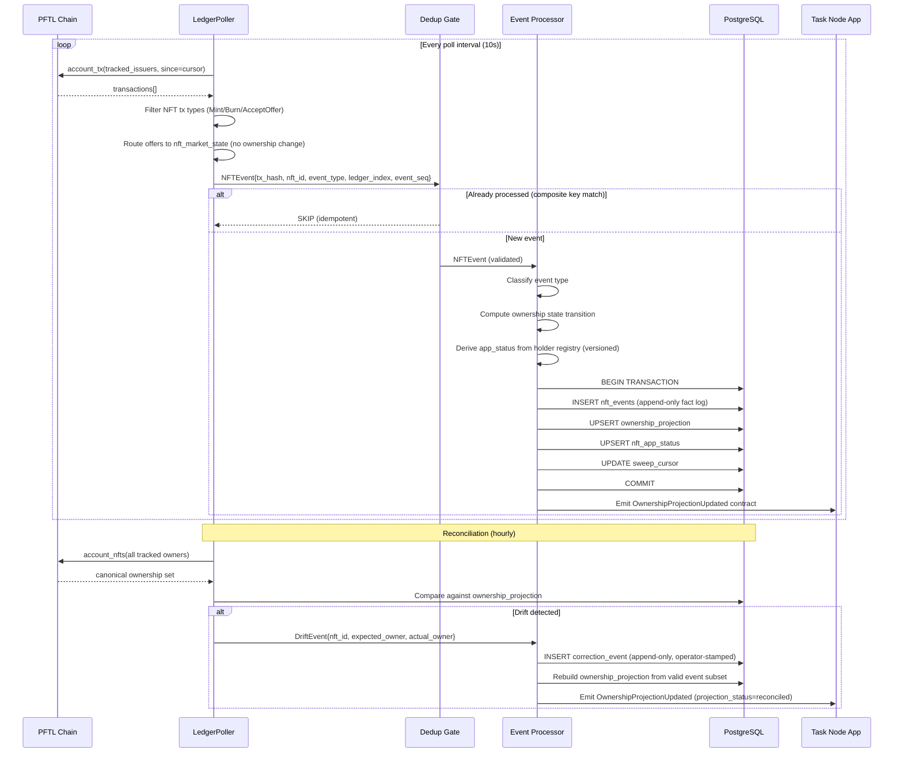
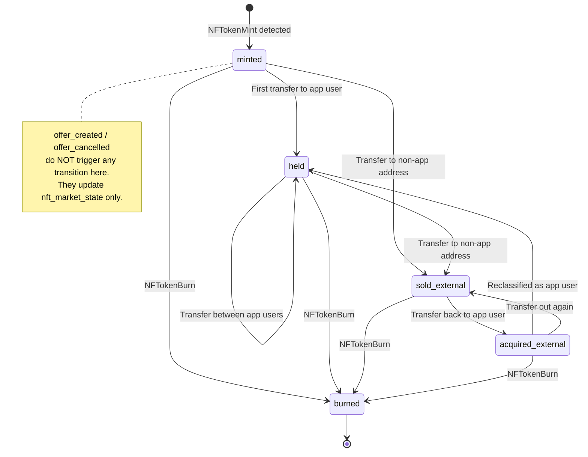
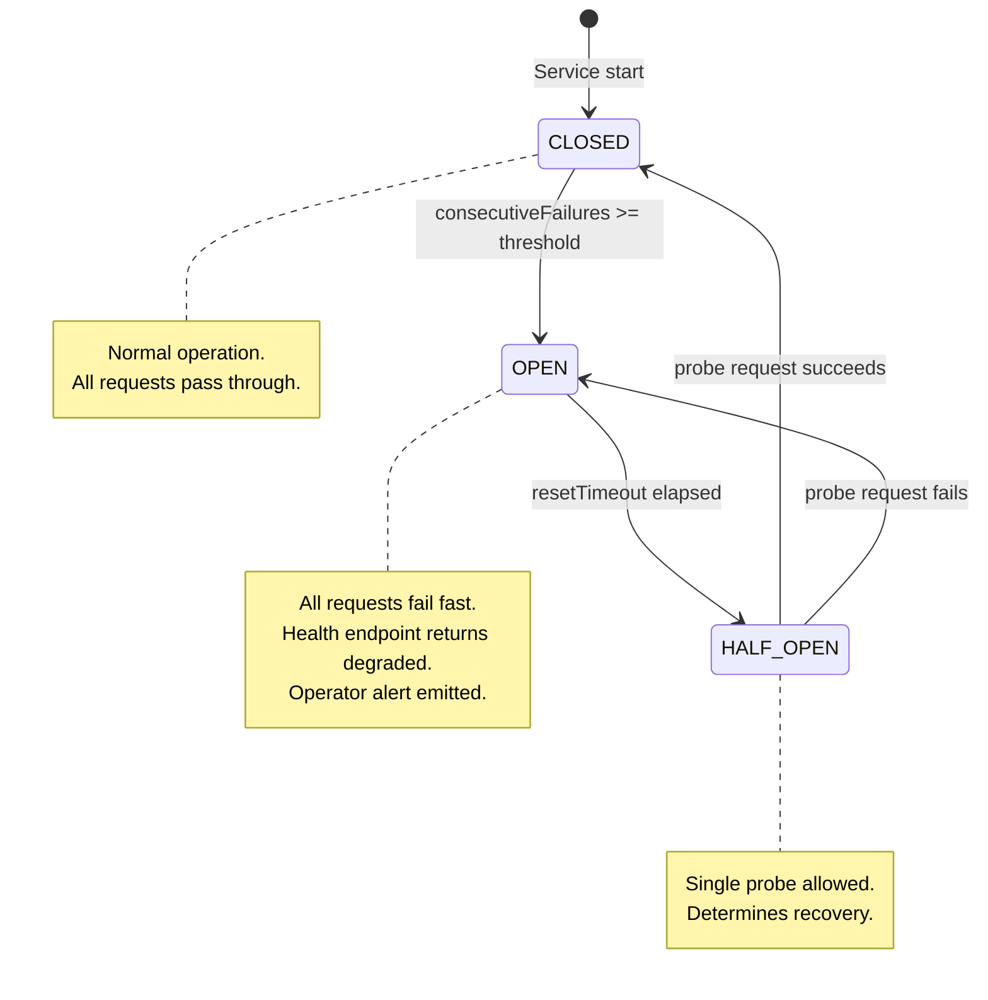

# NFT Ownership Sweeper Architecture Package — Canonical Ownership Detection and Task Node Projection for NestJS

## NestJS Backend Service for Post Fiat Task Node

**Version**: 2.0.0  
**Author**: Permanent Upper Class  
**Date**: 2026-04-16  
**Stack**: NestJS + TypeScript + XRPL/PFTL RPC + Clio Server + PostgreSQL

---

## 1. Target Audience and Use Cases

### Audience

| Stakeholder | Interest |
|-------------|----------|
| **Task Node operators** | Need accurate NFT ownership state to gate features, assign permissions, or verify holdings |
| **Platform developers** | Need a reliable event-driven service to sync off-app NFT transfers into the app's database |
| **Contributors** | Expect their NFT holdings (task badges, role tokens, achievement NFTs) to reflect correctly regardless of where the transfer happened |

### Use Cases

1. **Off-app sale detection**: A contributor sells a Task Node-issued NFT on an external marketplace or via a direct peer-to-peer `NFTokenAcceptOffer`. The sweeper detects the ownership change and updates the app's NFT status from `held` → `sold_external`.

2. **Incoming acquisition detection**: A user acquires a relevant NFT from an external source. The sweeper detects the new holder and creates or updates the app-side record to `acquired_external`.

3. **Burn detection**: An NFT is burned on-chain. The sweeper transitions the record to `burned` and prevents stale references.

4. **Mint detection**: A new NFT is minted by a tracked issuer. The sweeper creates an initial record in `minted` state.

5. **Periodic reconciliation**: A background job compares the app's NFT ownership table against the canonical on-chain state to catch any events missed by the real-time poller.

---

## 1.1 Non-Goals

This service is scoped to canonical ownership detection and Task Node projection. It explicitly does not:

- **Marketplace indexer**: The sweeper does not index all NFT listings, bid histories, or price feeds across external marketplaces. It only cares whether ownership changed — not the sale context or price discovery mechanics.
- **Metadata refresh service**: The sweeper does not periodically re-fetch or re-validate NFT metadata URIs or IPFS content. Metadata is treated as informational-only and is not part of the canonical state machine.
- **Valuation engine**: The sweeper assigns no monetary value to NFTs. Transfer amounts in drops are logged for audit purposes only and are never used to derive pricing or portfolio value.
- **Fraud adjudicator**: The sweeper does not determine whether a sale was coerced, wash-traded, or manipulated. It records what the ledger says happened. Fraud review is an operator responsibility.
- **Wallet-linking authority**: The sweeper does not establish or verify the relationship between an XRPL address and an application user account. That mapping lives in the holder registry, which is operator-controlled and versioned separately.

---

## 1.2 Inputs and Trust Levels

All data entering the sweeper is classified by trust level. Canonical inputs drive ownership projection writes. Non-canonical inputs inform app-layer interpretation only.

| Input | Trust Level | Notes |
|-------|-------------|-------|
| **Validated ledger tx stream** | Canonical | Source of truth for all ownership transitions. Only finalized (validated) ledger transactions are processed. Pending or speculative transactions are never applied. |
| **account_nfts snapshot** | Canonical (periodic) | Authoritative owner set from the RPC node at query time. Used by reconciliation to detect drift. Subject to a staleness window between poll cycles. |
| **Holder registry** | App-controlled, versioned | Maps XRPL addresses to application user identities. Operator-managed. Changes are version-stamped. App status interpretation depends on the holder registry version at derivation time. |
| **Manual correction event** | Operator-controlled, auditable | Used to correct projection errors that cannot be resolved through normal chain replay. Requires an operator identity and reason code. Append-only; never deletes canonical events. |
| **NFT metadata URI** | Informational only | Retrieved on mint or demand. Never used to infer ownership. Subject to off-chain availability issues. Stored for display purposes only. |

---

## 2. System Architecture

### 2.1 Component Overview

```
┌─────────────────────────────────────────────────────────────────────┐
│                        PFTL Chain (RPC Node)                        │
│                                                                     │
│   account_tx / subscribe / account_nfts / nft_info                  │
└───────────────┬───────────────────────────┬─────────────────────────┘
                │ poll / stream              │ on-demand query
                ▼                            ▼
┌───────────────────────────┐   ┌────────────────────────────────────┐
│   Ingestion Module        │   │   Reconciliation Module            │
│                           │   │                                    │
│   • LedgerPoller          │   │   • Full-state comparator          │
│   • WebSocket subscriber  │   │   • Drift detector                 │
│   • Raw tx → NFTEvent     │   │   • Runs on cron (hourly/daily)    │
│   • Deduplication gate    │   │                                    │
└──────────┬────────────────┘   └──────────────┬─────────────────────┘
           │ NFTEvent                           │ DriftReport
           ▼                                    ▼
┌─────────────────────────────────────────────────────────────────────┐
│                     Event Processor Module                          │
│                                                                     │
│   • Validate event (signature, ledger finality)                     │
│   • Classify: mint | transfer | burn                                │
│   • Offer events routed to nft_market_state (NOT ownership)         │
│   • Compute state transition                                        │
│   • Idempotency check (composite unique key dedup)                  │
│   • Apply transition to ownership_projection                        │
│   • Derive nft_app_status from holder registry (versioned)          │
│   • Emit OwnershipProjectionUpdated contract for Task Node          │
└──────────┬──────────────────────────────────────────────────────────┘
           │
           ▼
┌─────────────────────────────────────────────────────────────────────┐
│                        PostgreSQL                                   │
│                                                                     │
│   ownership_projection  │  nft_app_status  │  nft_events (immutable)│
│   nft_market_state      │  sweep_cursor    │  holder_registry_snaps │
│   correction_events     │                  │                        │
└──────────┬──────────────────────────────────────────────────────────┘
           │ OwnershipProjectionUpdated domain event
           ▼
┌─────────────────────────────────────────────────────────────────────┐
│                     Task Node Application                           │
│                                                                     │
│   • Reads nft_app_status (never raw chain tx)                       │
│   • Feature gating driven by OwnershipProjectionUpdated contract    │
│   • Profile display (show held NFTs)                                │
│   • Achievement verification                                        │
└─────────────────────────────────────────────────────────────────────┘
```

### 2.2 Event Flow (Mermaid)



---

## 3. TypeScript Interface Sketches

### 3.1 Core Domain Types

```typescript
// ─── NFT Identity ───────────────────────────────────────────────────

interface NFTokenId {
  /** XRPL NFToken ID (64 hex chars) */
  nft_id: string;
  /** Issuer XRPL address */
  issuer: string;
  /** NFT taxon (category grouping) */
  taxon: number;
  /** Serial number within the taxon */
  serial: number;
  /** Transfer fee in basis points (0-50000) */
  transfer_fee: number;
  /** Flags bitmask */
  flags: number;
}

// ─── NFT Event (from chain) ────────────────────────────────────────

type NFTEventType =
  | 'mint'           // NFTokenMint
  | 'burn'           // NFTokenBurn
  | 'transfer'       // NFTokenAcceptOffer (ownership changed)
  | 'offer_created'  // NFTokenCreateOffer — routed to nft_market_state only
  | 'offer_cancelled'; // NFTokenCancelOffer — routed to nft_market_state only

interface NFTEvent {
  /**
   * Composite unique key: (ledger_index, tx_hash, nft_id, event_type, event_seq).
   * A single transaction can produce multiple sub-events (e.g. a batch mint that
   * emits one NFTokenMint and one implicit transfer in the same tx). Using only
   * SHA-256(tx_hash + nft_id + event_type) would collapse those into a single
   * hash and lose the second event. The composite key encodes positional uniqueness
   * within a transaction while remaining stable across replays.
   */
  event_hash: string; // SHA-256(ledger_index|tx_hash|nft_id|event_type|event_seq)
  /** Sequence position of this sub-event within the transaction (0-based) */
  event_seq: number;
  /** On-chain transaction hash */
  tx_hash: string;
  /** Ledger index where the event was validated */
  ledger_index: number;
  /** Ledger close time (ISO 8601) */
  ledger_time: string;
  /** Event classification */
  event_type: NFTEventType;
  /** The NFToken involved */
  nft_id: string;
  /** Previous owner (null for mint) */
  from_address: string | null;
  /** New owner (null for burn) */
  to_address: string | null;
  /** Amount paid in drops (0 for free transfers) */
  amount_drops: string;
  /** Whether this was detected via real-time poll or reconciliation */
  detection_source: 'poll' | 'reconciliation' | 'websocket';
  /** Raw transaction JSON for audit */
  raw_tx: Record<string, unknown>;
}

// ─── NFT Status (app-layer business label) ─────────────────────────

type NFTStatus =
  | 'minted'             // Just created, held by issuer
  | 'held'               // Held by a known app user
  | 'sold_external'      // Transferred out via off-app sale
  | 'acquired_external'  // Acquired from outside the app
  | 'burned'             // Destroyed on-chain
  | 'unknown';           // Exists on-chain but not yet classified

// ─── Projection Confidence ─────────────────────────────────────────

/**
 * How certain is the sweeper about the canonical owner in ownership_projection?
 *
 * observed    — event seen in a validated ledger tx; not yet at confirmation depth
 * confirmed   — event has reached confirmationDepth; safe to act on
 * reconciled  — ownership verified by account_nfts snapshot comparison
 * corrected   — manually repaired via a CorrectionEvent; audit trail present
 */
type ProjectionConfidence = 'observed' | 'confirmed' | 'reconciled' | 'corrected';

// ─── Reason Codes ──────────────────────────────────────────────────

/**
 * Machine-readable explanation for why an ownership or app-status transition occurred.
 * Attached to OwnershipProjectionUpdated events so Task Node consumers can apply
 * appropriate handling without re-inspecting raw chain data.
 */
type ReasonCode =
  | 'TX_CONFIRMED_DEPTH_REACHED'       // Event promoted from observed → confirmed
  | 'OWNER_MATCHED_TRACKED_HOLDER'     // new owner found in holder registry
  | 'OWNER_NOT_IN_TRACKED_SET'         // new owner not in holder registry
  | 'BURN_CONFIRMED'                   // NFTokenBurn validated
  | 'DRIFT_DETECTED'                   // Reconciliation found DB/chain mismatch
  | 'DRIFT_CORRECTED'                  // Reconciliation auto-corrected the drift
  | 'HOLDER_REGISTRY_RECLASSIFIED'     // App status changed due to registry update, not chain event
  | 'REPLAY_DUPLICATE_SKIPPED';        // Event arrived but composite key already existed

// ─── Ownership Projection (canonical chain truth) ──────────────────

/**
 * What the ledger says about this NFT right now.
 * This record is updated only by validated chain events or reconciliation.
 * It is a disposable projection — it can be fully rebuilt from nft_events
 * plus correction_events at any time.
 */
interface OwnershipProjection {
  /** XRPL NFToken ID */
  nft_id: string;
  /** Current owner per canonical chain state (null if burned) */
  canonical_owner: string | null;
  /** Ledger index at which canonical_owner was last confirmed */
  canonical_owner_ledger: number;
  /** Confidence level of the current projection */
  ownership_confidence: ProjectionConfidence;
  /**
   * How the current owner was determined:
   *   'poll'           — from live tx stream
   *   'reconciliation' — from account_nfts snapshot
   *   'correction'     — from a CorrectionEvent
   *   'websocket'      — from real-time WebSocket subscription
   */
  source_path: 'poll' | 'reconciliation' | 'correction' | 'websocket';
  /** tx_hash of the most recent validated transaction that affected this NFT */
  last_observed_tx_hash: string;
}

// ─── NFT App Status (business interpretation) ──────────────────────

/**
 * What the app says about this NFT based on the holder registry.
 * Derived from ownership_projection + holder_registry at a specific version.
 * This record is a disposable projection — it can be rebuilt from
 * ownership_projection + holder_registry_snapshots at any time.
 */
interface NFTAppStatus {
  /** XRPL NFToken ID */
  nft_id: string;
  /** Business-layer status label */
  app_status: NFTStatus;
  /** The canonical_owner value that this derivation was based on */
  derived_from_owner: string | null;
  /** Holder registry version used when deriving app_status */
  derived_from_holder_registry_version: number;
  /** Machine-readable reason for the current app_status */
  derivation_reason_code: ReasonCode;
}
```

### 3.2 Service Interfaces

```typescript
// ─── Ingestion Service ─────────────────────────────────────────────

interface SweeperConfig {
  /** PFTL RPC endpoint */
  rpcUrl: string;
  /** WebSocket endpoint (optional, for streaming mode) */
  wssUrl?: string;
  /** XRPL addresses to track as NFT issuers */
  trackedIssuers: string[];
  /** XRPL addresses to track as NFT holders (app users) */
  trackedHolders: string[];
  /** Poll interval in milliseconds */
  pollIntervalMs: number;
  /** Maximum transactions per poll batch */
  batchSize: number;
  /** Minimum ledger confirmations before processing */
  confirmationDepth: number;
}

interface IIngestionService {
  /** Start polling/streaming for NFT events */
  start(): Promise<void>;
  /** Stop polling */
  stop(): Promise<void>;
  /** Get current sweep cursor position */
  getCursor(): Promise<SweepCursor>;
  /** Manually process a specific ledger range */
  backfill(fromLedger: number, toLedger: number): Promise<number>;
}

// ─── Event Processor ───────────────────────────────────────────────

interface IEventProcessor {
  /** Process a single NFT event — idempotent */
  processEvent(event: NFTEvent): Promise<ProcessResult>;
  /** Process a batch of events in order */
  processBatch(events: NFTEvent[]): Promise<ProcessResult[]>;
}

interface ProcessResult {
  event_hash: string;
  status: 'applied' | 'duplicate' | 'rejected' | 'deferred';
  reason: string | null;
  state_transition: StateTransition | null;
}

interface StateTransition {
  nft_id: string;
  from_status: NFTStatus;
  to_status: NFTStatus;
  from_owner: string | null;
  to_owner: string | null;
  event_hash: string;
  ledger_index: number;
}

// ─── Reconciliation Service ────────────────────────────────────────

interface IReconciliationService {
  /** Compare on-chain state against DB and return drifts */
  reconcile(): Promise<DriftReport>;
  /** Auto-correct detected drifts via append-only correction model */
  autoCorrect(report: DriftReport): Promise<CorrectionResult>;
}

interface DriftReport {
  checked_at: string;
  nfts_checked: number;
  drifts_detected: number;
  drifts: DriftEntry[];
}

interface DriftEntry {
  nft_id: string;
  db_owner: string;
  db_status: NFTStatus;
  chain_owner: string;
  chain_exists: boolean;
  recommended_action: 'update_owner' | 'mark_burned' | 'create_record';
}

// ─── Sweep Cursor ──────────────────────────────────────────────────

interface SweepCursor {
  /** Last processed ledger index */
  last_ledger_index: number;
  /** Timestamp of last successful sweep */
  last_sweep_at: string;
  /** Number of events processed in last sweep */
  events_processed: number;
  /** Whether the cursor is caught up to the validated ledger */
  is_current: boolean;
}
```

### 3.3 NestJS Module Structure

```typescript
// ─── Module Registration ───────────────────────────────────────────

@Module({
  imports: [
    TypeOrmModule.forFeature([
      OwnershipProjectionEntity,
      NFTAppStatusEntity,
      NFTEventEntity,
      SweepCursorEntity,
      HolderRegistrySnapshotEntity,
      CorrectionEventEntity,
    ]),
    ScheduleModule.forRoot(),
    HttpModule,
  ],
  providers: [
    IngestionService,
    EventProcessorService,
    ReconciliationService,
    HolderRegistryService,
    XrplClientProvider,
  ],
  exports: [EventProcessorService],
})
export class NftSweeperModule {}

// ─── Cron Jobs ─────────────────────────────────────────────────────

@Injectable()
export class IngestionService implements OnModuleInit, OnModuleDestroy {
  @Cron(CronExpression.EVERY_10_SECONDS)
  async pollLedger(): Promise<void> {
    // Fetch new transactions since cursor
    // Parse NFT events — route offers to nft_market_state, not ownership
    // Process through EventProcessor
    // Advance cursor
  }

  @Cron(CronExpression.EVERY_HOUR)
  async reconcile(): Promise<void> {
    // Full state comparison against account_nfts snapshot
    // Detect and correct drifts via append-only correction model
    // Reclassify nft_app_status if holder registry version changed
  }
}
```

### 3.4 Task Node Integration Contract

The `OwnershipProjectionUpdated` interface is the **only** mechanism by which the Task Node application should learn about ownership changes. Task Nodes must not read raw `nft_events` rows or infer ownership from direct chain queries.

```typescript
interface OwnershipProjectionUpdated {
  nft_id: string;
  ledger_index: number;
  tx_hash: string;
  canonical_owner: string | null;
  previous_owner: string | null;
  ownership_event_type: 'mint' | 'transfer' | 'burn' | 'correction';
  projection_status: ProjectionConfidence;
  app_status_recommendation: NFTStatus;
  reason_codes: ReasonCode[];
  holder_registry_version: number;
  observed_at: string;
}
```

**Task Node consumption rules**:

- **Task Node must not infer from raw chain tx directly.** All ownership signals flow through `OwnershipProjectionUpdated`. Direct chain polling by the Task Node is prohibited to prevent split-brain state.
- **Task Node only updates its `nft_status` table from this contract.** The contract is the single write authority for NFT status in the Task Node database.
- **Task Node treats `confirmed` and `reconciled` as writeable.** Events at these confidence levels may trigger permission changes, feature gating, and cache updates.
- **Task Node treats `observed` as non-destructive / warning-only.** Show a pending badge or advisory indicator. Do not revoke access or change permissions until confidence reaches `confirmed` or higher.

**Task Node Write Policy**:

| app_status_recommendation | projection_status | Task Node action |
|---------------------------|-------------------|-----------------|
| `burned` | `confirmed` or `reconciled` | Immediate hard revoke — remove all feature access, mark record terminal |
| `sold_external` | `confirmed` or `reconciled` | Revoke feature access gated on NFT holding |
| `acquired_external` | `confirmed` or `reconciled` | Enable access after holder registry match confirms app user identity |
| any | `observed` only | Show pending badge; no permission change |
| any | `corrected` | Rebuild all dependent caches from scratch using updated projection |

### 3.5 Holder Registry Versioning

The holder registry is the app-controlled mapping from XRPL addresses to application user identities. Because this mapping is mutable, every app-status derivation must be reproducible at the registry version that was current when it was computed.

```typescript
interface HolderRegistrySnapshot {
  /** Monotonically incrementing version number */
  version: number;
  /** ISO 8601 timestamp when this version was activated */
  activated_at: string;
  /** Operator who published this version */
  published_by: string;
  /** Mapping of XRPL address → app user ID at this version */
  address_to_user: Record<string, string>;
  /** Human-readable description of what changed in this version */
  change_summary: string;
}
```

**Versioning rules**:

- Every `NFTAppStatus` record stores the `holder_registry_version` used to derive it.
- When the holder registry is updated (new version published), a reclassification job may replay `nft_app_status` derivations for all affected NFTs using the new registry. Canonical chain ownership does not change — only the app-layer interpretation of who that owner maps to.
- Reclassification events are emitted as `OwnershipProjectionUpdated` with `reason_codes: ['HOLDER_REGISTRY_RECLASSIFIED']` so Task Nodes can distinguish registry-driven updates from chain-driven ones.
- The `holder_registry_version` is included in every `OwnershipProjectionUpdated` payload so the Task Node can audit which registry interpretation was active at derivation time.

---

## 4. Database Status Transition Logic

### 4.1 State Machine

Offer transactions (`NFTokenCreateOffer`, `NFTokenCancelOffer`) **do not change ownership state** and are **not shown in this diagram**. They update a separate `nft_market_state` projection only. An accepted offer that produces an actual owner change (i.e., `NFTokenAcceptOffer` resulting in a transfer) may mutate `ownership_projection`, but the creation or cancellation of an offer by itself has no effect on this state machine.



### 4.2 Transition Rules (Deterministic)

| Current Status | Event Type | Condition | New Status |
|---------------|------------|-----------|------------|
| — (no record) | `mint` | Issuer is tracked | `minted` |
| — (no record) | `transfer` | `to_address` is tracked holder | `acquired_external` |
| `minted` | `transfer` | `to_address` is tracked holder | `held` |
| `minted` | `transfer` | `to_address` is NOT tracked | `sold_external` |
| `minted` | `burn` | — | `burned` |
| `held` | `transfer` | `to_address` is tracked holder | `held` (owner updated) |
| `held` | `transfer` | `to_address` is NOT tracked | `sold_external` |
| `held` | `burn` | — | `burned` |
| `sold_external` | `transfer` | `to_address` is tracked holder | `acquired_external` |
| `sold_external` | `burn` | — | `burned` |
| `acquired_external` | `transfer` | `to_address` is tracked holder | `held` |
| `acquired_external` | `transfer` | `to_address` is NOT tracked | `sold_external` |
| `acquired_external` | `burn` | — | `burned` |
| `burned` | any | — | **REJECT** (burned is terminal) |
| any | `offer_created` | — | **NO-OP on ownership** (update nft_market_state) |
| any | `offer_cancelled` | — | **NO-OP on ownership** (update nft_market_state) |

### 4.3 Transition SQL

```sql
-- Apply a state transition to ownership_projection (called within a transaction)
UPDATE ownership_projection SET
  canonical_owner = :new_owner,
  canonical_owner_ledger = :ledger_index,
  ownership_confidence = :confidence,
  source_path = :source_path,
  last_observed_tx_hash = :tx_hash,
  updated_at = NOW()
WHERE nft_id = :nft_id
  AND canonical_owner_ledger <= :ledger_index;  -- Never apply stale events

-- Apply derived app status update (called within the same transaction)
UPDATE nft_app_status SET
  app_status = :new_app_status,
  derived_from_owner = :new_owner,
  derived_from_holder_registry_version = :registry_version,
  derivation_reason_code = :reason_code,
  updated_at = NOW()
WHERE nft_id = :nft_id;
```

---

## 5. Risk Section

### 5.1 Scalability

| Risk | Mitigation |
|------|-----------|
| **High NFT volume** overwhelms poller | Batch processing with configurable `batchSize`. Cursor-based pagination. Backpressure via queue (Bull/BullMQ) if event rate exceeds processing rate. |
| **Many tracked addresses** slow down `account_tx` calls | Partition tracked addresses into shards. Each shard gets its own poller instance. Round-robin across multiple RPC nodes. |
| **Database write contention** on ownership tables | Append-only event log (`nft_events`) is the primary write target. `ownership_projection` and `nft_app_status` are materialized projections updated asynchronously. Enables read replicas for the app. |
| **Reconciliation takes too long** on large NFT sets | Paginate `account_nfts` calls. Compare in batches of 1000. Skip NFTs that haven't changed since last reconciliation (use `canonical_owner_ledger` as a watermark). |

**Throughput assumption**: The PFTL testnet produces ~1 ledger every 3-4 seconds. With ~10K NFT transactions per day (current volume), a 10-second poll interval processes ~30 transactions per cycle — well within single-node capacity. At 100x scale (1M NFT txns/day), the queue-based architecture handles burst ingestion while the processor works through the backlog.

### 5.2 Duplicate Detection

The dedup key was strengthened from `SHA-256(tx_hash + nft_id + event_type)` to a composite unique key: **(ledger_index, tx_hash, nft_id, event_type, event_seq)**.

**Why**: A single transaction can imply multiple sub-events. For example, a batch mint operation or an offer acceptance that triggers both a transfer and a royalty distribution may produce two distinct NFT sub-events within the same `tx_hash`. The original hash scheme would collapse both sub-events to the same key and silently drop the second. The composite key encodes ledger position, transaction identity, NFT identity, event classification, and intra-transaction sequence number — making it stable across replays while correctly distinguishing co-transaction sub-events.

| Risk | Mitigation |
|------|-----------|
| **Same event polled twice** (overlapping cursor windows) | Composite unique key `(ledger_index, tx_hash, nft_id, event_type, event_seq)` is a UNIQUE constraint on `nft_events`. INSERT fails silently on duplicate. |
| **Reorg causes same ledger to appear with different transactions** | `confirmationDepth` setting (default: 3 ledgers). Only process events from ledgers that are `validated_ledger - confirmationDepth` or older. |
| **Reconciliation re-detects known events** | Reconciliation creates `CorrectionEvent` entries, not regular `NFTEvent` entries. Different table, different processing path. No cross-contamination. |
| **Multiple poller instances running** | Cursor is stored in DB with `SELECT ... FOR UPDATE` locking. Only one poller can advance the cursor at a time. Second instance waits or skips. |

**Idempotency guarantee**: Every event is identified by its composite key. The `processEvent()` function checks for existence before processing. If the composite key exists, it returns `{ status: 'duplicate' }` without side effects. This makes the entire pipeline safe to retry.

### 5.3 Replay Handling

| Risk | Mitigation |
|------|-----------|
| **Cursor reset** causes full history replay | Events table has UNIQUE composite key constraint. Replayed events are deduplicated at INSERT. State transitions are only applied if `ledger_index > canonical_owner_ledger` on the projection. |
| **Out-of-order event delivery** | Events are sorted by `ledger_index` before processing. Within the same ledger, sorted by transaction index and `event_seq`. The `canonical_owner_ledger` guard prevents stale updates. |
| **Manual backfill overlaps with live polling** | Backfill and live polling share the same `processEvent()` path. Deduplication handles overlap automatically. Backfill does NOT advance the live cursor. |

**Replay safety proof**: If you delete the `sweep_cursor` row and restart the poller, it will re-scan from ledger 0. Every event it encounters will hit the dedup check (composite UNIQUE constraint). Only genuinely new events (from the gap between old cursor and current ledger) will be processed. The `ownership_projection` table will not be corrupted because the `canonical_owner_ledger` guard prevents older events from overwriting newer state.

### 5.4 Rollback Safety

The sweeper uses an **append-only correction model**. The nuclear delete-and-rebuild approach previously documented here is retired. Deleting from `nft_events` destroys the audit log, makes it impossible to trace the provenance of a state, and creates a window during replay where projections are in an indeterminate state.

Instead, corrections are recorded as `CorrectionEvent` rows that mark specific events as invalidated. Projections are rebuilt from the valid (non-invalidated) subset of `nft_events` plus any `replacement_projection` specified in the correction.

```typescript
interface CorrectionEvent {
  /** UUID for this correction record */
  correction_id: string;
  /** The NFT this correction applies to */
  nft_id: string;
  /** When this correction was created */
  created_at: string;
  /** Operator identity (XRPL address or system ID) that authorized the correction */
  operator: string;
  /** Why this correction was created */
  reason_code: 'MANUAL_REPAIR' | 'ROLLBACK_RECOVERY' | 'REGISTRY_RECLASSIFICATION';
  /**
   * event_hash values (composite key hashes) from nft_events that this correction
   * marks as invalidated. These rows are NOT deleted — they are flagged with
   * invalidated_by_correction_id = correction_id. Projection rebuilds skip them.
   */
  invalidates_event_hashes: string[];
  /**
   * Optional replacement projection state. If provided, the projection rebuild
   * applies this partial state after replaying all valid events.
   */
  replacement_projection?: Partial<StateTransition>;
}
```

**Rollback recovery procedure (append-only)**:
1. Identify the bad event hashes (by ledger index, tx_hash, or manual inspection)
2. Insert a `CorrectionEvent` with `reason_code: 'ROLLBACK_RECOVERY'` listing the invalidated hashes
3. Mark affected `nft_events` rows with `invalidated_by_correction_id` (non-destructive flag)
4. Trigger a projection rebuild for affected `nft_id` values from the valid event subset
5. Emit `OwnershipProjectionUpdated` with `projection_status: 'corrected'` for each rebuilt NFT
6. Task Node receives the corrected event and rebuilds dependent caches

Original rows are preserved. The audit trail is complete. No data is lost.

| Risk | Mitigation |
|------|-----------|
| **Ledger rollback / fork** invalidates processed events | `confirmationDepth` ensures events are only processed after N confirmations. On PFTL testnet with 5 validators, depth=3 is sufficient. |
| **Application crash mid-transaction** | All state changes (event insert + projection update + cursor advance) happen in a single PostgreSQL transaction. Crash = rollback = no partial state. |
| **Incorrect state transition applied** | `nft_events` is append-only and never modified. Full audit trail enables reconstruction of any record's state by replaying its events in order. |
| **Need to undo a bad event** | Insert a `CorrectionEvent` invalidating the bad hash. Rebuild projection from valid subset. Never delete from `nft_events`. |

### 5.5 Operational Envelope

The following SLOs define what "healthy" means for the sweeper at steady state. Breaching these thresholds should trigger an alert.

| Metric | Target | Breach threshold | Notes |
|--------|--------|-----------------|-------|
| **Detection latency** | < 20s at steady state | > 60s | Measured from ledger close to `OwnershipProjectionUpdated` emitted |
| **Max lag before unhealthy** | ≤ 30 ledgers behind validated | > 30 ledgers | Health endpoint returns degraded; feature gating switches to conservative mode |
| **Reconciliation completion** | < 15 min per 100k tracked NFTs | > 30 min | Paginated `account_nfts` batches; alert if single cycle exceeds threshold |
| **False duplicate rate** | 0 | Any > 0 | A duplicate event reaching the write path is a bug in dedup logic |
| **Stale-gating window for burns** | 0 — burns must gate immediately on `confirmed` | Any non-zero stale window | Burns are irreversible; no grace period |
| **Stale-gating window for acquisitions** | ≤ 1 reconciliation cycle | > 1 cycle | Acquisition access may be granted after the next reconciliation confirms holder match |

---

## 6. Deployment Considerations

### 6.1 NestJS Service Configuration

```typescript
// config/sweeper.config.ts
export default registerAs('sweeper', () => ({
  rpcUrl: process.env.PFTL_RPC_URL ?? 'http://127.0.0.1:5015',
  wssUrl: process.env.PFTL_WSS_URL ?? 'wss://ws.testnet.postfiat.org',
  pollIntervalMs: parseInt(process.env.SWEEP_INTERVAL_MS ?? '10000'),
  batchSize: parseInt(process.env.SWEEP_BATCH_SIZE ?? '100'),
  confirmationDepth: parseInt(process.env.SWEEP_CONFIRMATION_DEPTH ?? '3'),
  trackedIssuers: (process.env.TRACKED_ISSUERS ?? '').split(',').filter(Boolean),
  trackedHolders: [], // Dynamically loaded from holder registry (versioned)
  reconciliationCron: process.env.RECONCILIATION_CRON ?? '0 * * * *', // Hourly
}));
```

### 6.2 Health Check Endpoint

```typescript
@Controller('sweeper')
export class SweeperController {
  @Get('health')
  async health(): Promise<SweeperHealth> {
    const cursor = await this.ingestionService.getCursor();
    const validatedLedger = await this.xrplClient.getValidatedLedger();
    const lagLedgers = validatedLedger - cursor.last_ledger_index;
    return {
      status: lagLedgers <= 30 ? (cursor.is_current ? 'healthy' : 'catching_up') : 'degraded',
      cursor_ledger: cursor.last_ledger_index,
      validated_ledger: validatedLedger,
      lag_ledgers: lagLedgers,
      last_sweep_at: cursor.last_sweep_at,
      events_processed_last_sweep: cursor.events_processed,
    };
  }
}
```

### 6.3 Database Schema Notes

```sql
-- nft_events: immutable fact log — never UPDATE or DELETE rows
-- invalidated_by_correction_id is a non-destructive flag; the row stays
CREATE TABLE nft_events (
  event_hash               TEXT PRIMARY KEY,  -- SHA-256(ledger_index|tx_hash|nft_id|event_type|event_seq)
  event_seq                INTEGER NOT NULL,
  tx_hash                  TEXT NOT NULL,
  ledger_index             INTEGER NOT NULL,
  ledger_time              TIMESTAMPTZ NOT NULL,
  event_type               TEXT NOT NULL,
  nft_id                   TEXT NOT NULL,
  from_address             TEXT,
  to_address               TEXT,
  amount_drops             TEXT,
  detection_source         TEXT NOT NULL,
  raw_tx                   JSONB NOT NULL,
  invalidated_by_correction_id TEXT REFERENCES correction_events(correction_id),
  UNIQUE (ledger_index, tx_hash, nft_id, event_type, event_seq)
);

-- ownership_projection: disposable — rebuilt from nft_events + correction_events
CREATE TABLE ownership_projection (
  nft_id                   TEXT PRIMARY KEY,
  canonical_owner          TEXT,
  canonical_owner_ledger   INTEGER NOT NULL,
  ownership_confidence     TEXT NOT NULL,
  source_path              TEXT NOT NULL,
  last_observed_tx_hash    TEXT NOT NULL,
  updated_at               TIMESTAMPTZ NOT NULL DEFAULT NOW()
);

-- nft_app_status: disposable — rebuilt from ownership_projection + holder_registry_snapshots
CREATE TABLE nft_app_status (
  nft_id                              TEXT PRIMARY KEY,
  app_status                          TEXT NOT NULL,
  derived_from_owner                  TEXT,
  derived_from_holder_registry_version INTEGER NOT NULL,
  derivation_reason_code              TEXT NOT NULL,
  updated_at                          TIMESTAMPTZ NOT NULL DEFAULT NOW()
);
```

### 6.5 Projection Rebuildability

The separation of the immutable fact log from the disposable projections is a core design invariant:

- **`nft_events` is the immutable fact log.** Rows are never updated or deleted. The `invalidated_by_correction_id` column flags rows that should be skipped in projection rebuilds, but the rows remain as a permanent audit record.
- **`ownership_projection` is a disposable projection.** It can be truncated and rebuilt at any time by replaying all non-invalidated `nft_events` rows in ledger order, applying `CorrectionEvent` replacements at the end.
- **`nft_app_status` is a disposable projection.** It can be truncated and rebuilt at any time from: (1) the current `ownership_projection`, (2) the appropriate `holder_registry_snapshot` version, and (3) any `correction_events` with `reason_code: 'REGISTRY_RECLASSIFICATION'`.

**Rebuild inputs required**:

| Projection | Required inputs |
|------------|----------------|
| `ownership_projection` | Non-invalidated `nft_events` (sorted by ledger_index, event_seq) + `correction_events` (ROLLBACK_RECOVERY and MANUAL_REPAIR) |
| `nft_app_status` | Current `ownership_projection` + `holder_registry_snapshots` (at correct version per NFT) + `correction_events` (REGISTRY_RECLASSIFICATION) |

This means a complete data recovery from `nft_events` loss is not possible — `nft_events` must be protected with point-in-time backup. However, loss of `ownership_projection` or `nft_app_status` tables is fully recoverable with no data loss.

---

## 7. Acceptance Criteria

| # | Criterion | Measurable Check |
|---|-----------|-----------------|
| 1 | Sold detection | When an app-tracked NFT is transferred to an external address, `ownership_projection` and `nft_app_status` transition to `sold_external` within `pollIntervalMs + processing time` |
| 2 | Acquired detection | When a tracked holder receives an NFT from an external source, a new record is created with status `acquired_external` |
| 3 | Burn detection | When a tracked NFT is burned, status transitions to `burned`; Task Node receives `OwnershipProjectionUpdated` with `ownership_event_type: 'burn'` and `projection_status: 'confirmed'` |
| 4 | Rollback safety | Processing an event with `ledger_index < canonical_owner_ledger` is rejected without modifying state |
| 5 | Duplicate safety | Processing the same composite key `(ledger_index, tx_hash, nft_id, event_type, event_seq)` twice results in exactly one event record and one state transition |
| 6 | Reconciliation | Hourly reconciliation detects and corrects ownership drift between DB and chain within one cycle; completes in < 15 min per 100k tracked NFTs |
| 7 | Throughput | Poller processes 1000+ NFT events per minute on a single instance without falling behind |
| 8 | Crash recovery | After a simulated crash, restart from cursor produces identical final state as uninterrupted operation |
| 9 | Offer non-interference | `NFTokenCreateOffer` and `NFTokenCancelOffer` transactions do not mutate `ownership_projection`; they update `nft_market_state` only |
| 10 | Task Node contract | Task Node `nft_status` table is updated only via `OwnershipProjectionUpdated` events; direct chain queries from the Task Node produce no writes |
| 11 | Correction audit | Every `CorrectionEvent` is persisted with operator identity and reason code; invalidated `nft_events` rows remain in the table with `invalidated_by_correction_id` set |
| 12 | Registry versioning | Each `NFTAppStatus` row records the `holder_registry_version` used for derivation; reclassification replay produces new `OwnershipProjectionUpdated` events with `HOLDER_REGISTRY_RECLASSIFIED` reason code |
| 13 | Cold start bootstrap | On first deployment with no prior cursor, the sweeper initializes from the Clio full-history endpoint and populates `nft_events` from genesis without manual intervention |
| 14 | Circuit breaker | When the RPC node returns 5xx errors or connection timeouts for 3 consecutive poll cycles, the sweeper trips the circuit breaker, emits a `CIRCUIT_OPEN` health event, and pauses polling until the node recovers |
| 15 | Brokered sale detection | When an `NFTokenAcceptOffer` is submitted by a broker (Account is neither seller nor buyer), the event is classified as `brokered_transfer`; ownership is attributed to the buyer, not the broker |
| 16 | Dead Letter Queue routing | Events that cannot be classified after parser exhaustion are routed to the DLQ with full raw_tx payload; DLQ entries are never silently discarded and trigger an operator alert within 60 seconds |

---

## 8. Clio Server Integration

### 8.1 Why Clio

Clio is the XRPL full-history server that indexes validated ledger data and exposes it via a queryable API. The sweeper uses Clio for two purposes that the standard `rippled` RPC node cannot reliably serve:

1. **Cold start bootstrap**: On first deployment, the sweeper must scan the full transaction history for tracked issuers from ledger genesis. `rippled` nodes with limited history would return incomplete results. Clio's full-history index covers the complete ledger range.
2. **Gap fill during reconnect**: When the WebSocket subscription drops and the poller is offline for an extended period, the gap may exceed what a standard node's rolling window retains. Clio fills those gaps without requiring the operator to run a full-history `rippled` node.

### 8.2 Clio Client Interface

```typescript
interface ClioClientConfig {
  /** Clio HTTP endpoint */
  clioUrl: string;
  /** Request timeout in milliseconds */
  timeoutMs: number;
  /** Maximum retry attempts on 5xx or network error */
  maxRetries: number;
  /** Backoff base in milliseconds (exponential) */
  retryBackoffMs: number;
}

interface IClioClient {
  /**
   * Fetch all NFT-related transactions for a given issuer address
   * across a ledger range. Uses Clio's account_tx with full-history flag.
   */
  getAccountTxHistory(
    address: string,
    fromLedger: number,
    toLedger: number,
    marker?: string,
  ): Promise<ClioAccountTxPage>;

  /**
   * Fetch current NFT holdings for an address.
   * Clio's account_nfts supports ledger_index for point-in-time queries.
   */
  getAccountNfts(address: string, ledgerIndex?: number): Promise<ClioNftPage>;

  /**
   * Fetch metadata for a specific NFToken by ID.
   */
  getNftInfo(nftId: string): Promise<ClioNftInfo>;
}

interface ClioAccountTxPage {
  transactions: ClioTxRecord[];
  marker: string | null;
  ledger_index_min: number;
  ledger_index_max: number;
}

interface ClioTxRecord {
  tx: Record<string, unknown>;
  meta: Record<string, unknown>;
  validated: boolean;
  ledger_index: number;
}
```

### 8.3 Cold Start Bootstrap Procedure

When the sweeper starts and finds no `sweep_cursor` row in the database, it enters bootstrap mode:

```typescript
async function coldStartBootstrap(
  clioClient: IClioClient,
  config: SweeperConfig,
  processor: IEventProcessor,
): Promise<void> {
  const GENESIS_LEDGER = 32570; // First usable XRPL ledger index

  for (const issuer of config.trackedIssuers) {
    let marker: string | undefined;
    let page = 0;

    do {
      const result = await clioClient.getAccountTxHistory(
        issuer,
        GENESIS_LEDGER,
        'validated', // Clio shorthand for current validated ledger
        marker ?? undefined,
      );

      const nftEvents = result.transactions
        .filter(tx => isNftTransaction(tx))
        .map(tx => parseNftEvent(tx));

      await processor.processBatch(nftEvents);

      marker = result.marker ?? null;
      page++;

      logger.log(`Bootstrap: issuer=${issuer} page=${page} marker=${marker}`);
    } while (marker);
  }

  // After bootstrap, set cursor to current validated ledger
  await setCursorToValidatedLedger();
  logger.log('Cold start bootstrap complete. Switching to live poll mode.');
}
```

**Bootstrap invariants**:
- Bootstrap uses the same `processEvent()` path as live polling. All deduplication and state transition logic applies.
- Bootstrap does not set the cursor until all pages for all tracked issuers are processed. If bootstrap crashes mid-run, it restarts from the beginning. Deduplication ensures re-processed events are no-ops.
- Bootstrap progress is logged per page with issuer address and marker token for operational visibility.

---

## 9. WebSocket Resilience and Circuit Breaker

### 9.1 WebSocket Subscription Model

The sweeper supports two ingestion modes: **poll mode** (periodic `account_tx` HTTP calls) and **stream mode** (WebSocket `subscribe` to ledger and transaction streams). Stream mode provides lower latency but requires a persistent connection with reconnect logic.

```typescript
interface WebSocketResilience {
  /** Maximum reconnect attempts before circuit trips */
  maxReconnectAttempts: number;
  /** Initial reconnect delay in milliseconds */
  reconnectDelayMs: number;
  /** Maximum reconnect delay (exponential backoff cap) */
  maxReconnectDelayMs: number;
  /** Consecutive poll failures before circuit breaker opens */
  circuitBreakerThreshold: number;
  /** Time to wait in OPEN state before attempting half-open probe */
  circuitBreakerResetMs: number;
}
```

### 9.2 Reconnect and Gap Fill

```typescript
@Injectable()
export class WebSocketIngestionService {
  private reconnectAttempts = 0;
  private circuitState: 'CLOSED' | 'OPEN' | 'HALF_OPEN' = 'CLOSED';
  private lastConnectedLedger: number | null = null;

  async onDisconnect(lastLedger: number): Promise<void> {
    this.lastConnectedLedger = lastLedger;
    await this.scheduleReconnect();
  }

  async onReconnect(currentLedger: number): Promise<void> {
    if (this.lastConnectedLedger !== null) {
      const gapStart = this.lastConnectedLedger + 1;
      const gapEnd = currentLedger - this.config.confirmationDepth;

      if (gapEnd >= gapStart) {
        logger.warn(`WebSocket gap detected: ledgers ${gapStart}–${gapEnd}. Initiating Clio gap fill.`);
        await this.clioClient.getAccountTxHistory(/* ... fill gap ... */);
      }
    }

    this.reconnectAttempts = 0;
    this.circuitState = 'CLOSED';
  }

  private async scheduleReconnect(): Promise<void> {
    if (this.reconnectAttempts >= this.resilience.maxReconnectAttempts) {
      this.circuitState = 'OPEN';
      this.eventEmitter.emit('sweeper.circuit_open', { reason: 'ws_reconnect_exhausted' });
      logger.error('Circuit breaker OPEN: WebSocket reconnect attempts exhausted.');
      return;
    }

    const delay = Math.min(
      this.resilience.reconnectDelayMs * Math.pow(2, this.reconnectAttempts),
      this.resilience.maxReconnectDelayMs,
    );

    this.reconnectAttempts++;
    await sleep(delay);
    await this.connect();
  }
}
```

### 9.3 Circuit Breaker States



**Circuit breaker behavior**:
- In `OPEN` state, the sweeper emits a `sweeper.circuit_open` event, sets the health endpoint to `degraded`, and falls back to the last confirmed cursor position.
- Fallback to poll mode is automatic when the WebSocket circuit opens: the poller resumes from `last_ledger_index` using HTTP `account_tx` calls against the Clio endpoint.
- Operators receive an alert (configurable: log, webhook, or monitoring event) within 60 seconds of circuit opening.

---

## 10. Dead Letter Queue

### 10.1 DLQ Purpose

The Dead Letter Queue (DLQ) captures events that the sweeper's parser cannot classify after exhausting all known transaction types and classification heuristics. Rather than silently discarding unclassifiable events or crashing the pipeline, the sweeper routes them to the DLQ for operator review.

**Events are routed to the DLQ when**:
- The transaction type is an NFT transaction type but does not match any known parser (unknown future transaction type).
- The brokered sale parser cannot determine the buyer from offer metadata (see section 10.5).
- A classification produces a state transition that violates an invariant (e.g., transfer to a burned NFT) and cannot be auto-corrected.
- The `raw_tx` JSON is malformed or missing required fields and cannot be safely parsed.

### 10.2 DLQ Schema

```sql
CREATE TABLE nft_dlq (
  dlq_id            UUID PRIMARY KEY DEFAULT gen_random_uuid(),
  enqueued_at       TIMESTAMPTZ NOT NULL DEFAULT NOW(),
  tx_hash           TEXT NOT NULL,
  ledger_index      INTEGER NOT NULL,
  nft_id            TEXT,
  raw_tx            JSONB NOT NULL,
  failure_reason    TEXT NOT NULL,
  failure_category  TEXT NOT NULL,  -- 'unclassifiable' | 'invariant_violation' | 'parse_error' | 'brokered_ambiguous'
  resolved          BOOLEAN NOT NULL DEFAULT FALSE,
  resolved_at       TIMESTAMPTZ,
  resolved_by       TEXT,
  resolution_notes  TEXT
);

CREATE INDEX idx_dlq_unresolved ON nft_dlq (enqueued_at) WHERE resolved = FALSE;
CREATE INDEX idx_dlq_tx_hash ON nft_dlq (tx_hash);
```

### 10.3 DLQ Interface

```typescript
interface IDlqService {
  /** Enqueue an event that could not be classified */
  enqueue(entry: DlqEntry): Promise<void>;
  /** List unresolved DLQ entries */
  listUnresolved(limit: number, offset: number): Promise<DlqEntry[]>;
  /** Mark a DLQ entry as resolved with operator notes */
  resolve(dlqId: string, operator: string, notes: string): Promise<void>;
  /** Replay a resolved DLQ entry through the event processor */
  replay(dlqId: string): Promise<ProcessResult>;
}

interface DlqEntry {
  dlq_id: string;
  enqueued_at: string;
  tx_hash: string;
  ledger_index: number;
  nft_id: string | null;
  raw_tx: Record<string, unknown>;
  failure_reason: string;
  failure_category: 'unclassifiable' | 'invariant_violation' | 'parse_error' | 'brokered_ambiguous';
  resolved: boolean;
  resolved_at: string | null;
  resolved_by: string | null;
  resolution_notes: string | null;
}
```

### 10.4 DLQ Alerting

Every DLQ enqueue triggers an operator alert within 60 seconds. The alert payload includes:

- `tx_hash` and `ledger_index` for direct chain lookup
- `failure_category` to triage quickly
- `nft_id` if determinable
- A direct link to the DLQ entry in the operator console (if configured)

DLQ entries are never automatically discarded. Retention is indefinite until an operator resolves and optionally replays the entry.

---

## 10. Adversarial Analysis: What Could Fool the Sweeper?

### 10.1 Marketplace Transfers via Intermediate Escrow Addresses

**Scenario**: A marketplace routes NFT transfers through an intermediate escrow or settlement address rather than directly from seller to buyer. The sweeper sees `from: seller → to: escrow_addr` and then `from: escrow_addr → to: buyer` as two separate transfer events. If the escrow address is not in the holder registry, the first event triggers a `sold_external` classification before the second event arrives.

**Containment**: The sweeper stores owner facts separately from app interpretation. `ownership_projection.canonical_owner` records the actual chain owner at each step — escrow address included. `nft_app_status.app_status` is derived from that owner at derivation time. When the second event arrives (escrow → buyer), the projection is updated and `nft_app_status` is re-derived. The Task Node receives both `OwnershipProjectionUpdated` events in sequence and applies them in order. No irreversible action is taken on the first event because the intermediary state is `sold_external`, which triggers access revocation but not permanent record deletion. Acquisition by the buyer produces the subsequent correction.

### 10.2 Delayed Holder Linking Causing Misclassification

**Scenario**: A user acquires an NFT before their XRPL address is registered in the holder registry. The sweeper sees the transfer to an unrecognized address and classifies it as `acquired_external` rather than `held`.

**Containment**: The holder registry is versioned. When the user's address is added to the registry (new version published), the reclassification job re-derives `nft_app_status` for all NFTs whose `canonical_owner` is now a recognized holder. The Task Node receives `OwnershipProjectionUpdated` with `reason_codes: ['HOLDER_REGISTRY_RECLASSIFIED']` and updates its `nft_status` accordingly. No chain re-query is needed — canonical ownership is unchanged; only the app interpretation updates.

### 10.3 Burn-Like Absence Caused by Incomplete Node/Index Data

**Scenario**: A query to `account_nfts` for a tracked holder does not return a specific NFT due to partial indexing, RPC node lag, or a pagination bug. Reconciliation infers the NFT is burned or transferred away and triggers a `burned` or `sold_external` correction.

**Containment**: Reconciliation does not mark an NFT as burned based on absence from a single `account_nfts` result alone. A burn requires a validated `NFTokenBurn` transaction in the ledger tx stream. Absence from `account_nfts` during reconciliation produces a `DRIFT_DETECTED` report and triggers a targeted `nft_info` lookup to confirm current chain state before any corrective write. If `nft_info` returns an error or ambiguous result, the record is flagged as `drift_detected` and escalated to an operator alert rather than auto-corrected.

### 10.4 Multi-Instance Race During Shard Reassignment

**Scenario**: A poller instance is reassigned to a new shard (set of tracked addresses) while another instance is finishing the same shard. Both instances process overlapping events for the same NFT simultaneously.

**Containment**: Database-level uniqueness enforces deduplication. The composite UNIQUE constraint on `(ledger_index, tx_hash, nft_id, event_type, event_seq)` in `nft_events` causes one of the concurrent INSERTs to fail. The `sweep_cursor` uses `SELECT ... FOR UPDATE` row-level locking — only one instance holds the cursor lock at a time. The losing instance receives a lock conflict, retries after the winning instance releases, and finds the events already processed (duplicate detection path).

### 10.5 Malformed URI / Issuer Impersonation

**Scenario**: An attacker mints an NFT with an `Issuer` field set to the same address as a tracked legitimate issuer (possible if the attacker controls that address) or crafts a metadata URI that resembles a legitimate NFT's URI. The sweeper ingests the fake NFT and creates an `ownership_projection` record, potentially enabling fraudulent feature access.

**Containment**: The sweeper maintains a tracked issuer allowlist (`SweeperConfig.trackedIssuers`). Only NFTs minted by addresses on this list are ingested. The allowlist is operator-controlled and version-stamped. An attacker cannot spoof an issuer address they do not control. Metadata URIs are stored for display only and are never used to classify ownership or drive state transitions — a URI forgery has no effect on the state machine. The taxon and serial fields from `NFTokenId` provide additional discrimination if the same issuer address mints multiple NFT categories.

### 10.6 Brokered Sale Misattribution

Scenario: A broker facilitates an NFTokenAcceptOffer but the sweeper's parser fails to detect the brokered sale signature and misattributes ownership to the broker instead of the buyer.

Containment: The brokered sale parser explicitly checks for the presence of both NFTokenSellOffer and NFTokenBuyOffer in the transaction. If both are present and the Account field (the transaction submitter) is neither the seller nor the buyer, the event is classified as brokered_transfer with broker_address set to the Account field. Ownership is attributed to the buyer (the owner of the buy offer). If the parser cannot determine the buyer from the offer metadata, the event is routed to the Dead Letter Queue for manual review rather than applying a potentially incorrect ownership transition.

---

### 10.6 Brokered Sale Misattribution

**Scenario**: A broker calls `NFTokenAcceptOffer` referencing a sell offer and buy offer. The sweeper incorrectly attributes ownership to the broker (the `Account` field on the transaction) instead of the buyer (the `Owner` of the buy offer).

**Containment**: The brokered sale parser explicitly checks for the presence of both `NFTokenSellOffer` and `NFTokenBuyOffer` fields in the transaction. When both are present, the sweeper resolves the actual buyer from the buy offer's `Owner` field — not the transaction's `Account` field. The parser logs a warning if `Account` matches neither the seller nor the buyer, confirming brokered sale routing. Unit tests with fixture data from real PFTL brokered sales validate this parsing logic.

### 10.7 Rapid Flip Attack (Ownership Oscillation)

**Scenario**: An attacker rapidly transfers an NFT back and forth between two addresses within the same poll interval, causing the sweeper to see multiple conflicting ownership states in a single batch.

**Containment**: Events within a batch are always sorted by `(ledger_index, tx_index, event_seq)` before processing. The final ownership state after processing the full batch reflects the last event in ledger order — which is the canonical state. The `canonical_owner_ledger` guard ensures that out-of-order processing cannot cause an earlier event to overwrite a later one. Each intermediate state transition is recorded in `nft_events` for audit, but only the final projection matters for the Task Node.

---

## 11. Decision Log

| Decision | Rationale | Alternatives Considered |
|----------|-----------|------------------------|
| Composite dedup key over hash-only | Handles co-transaction sub-events (batch mints, transfer + royalty) | SHA-256(tx_hash + nft_id) — would collapse multi-event txns |
| Append-only corrections over delete-and-rebuild | Preserves audit trail; avoids indeterminate state during rebuild | DELETE FROM nft_events + full replay — destroys provenance |
| Separate ownership_projection from nft_app_status | Decouples chain truth from business interpretation; enables registry-driven reclassification without re-querying chain | Single unified table — tightly couples chain and app concerns |
| Clio integration as optional | Not all deployments will have a Clio server; graceful degradation to RPC-only | Clio as required dependency — limits deployment flexibility |
| Dead Letter Queue over fail-fast | Pipeline continuity; no single poison event blocks all subsequent processing | Halt on first error — unacceptable for a continuous polling service |
| Circuit breaker on RPC calls | Prevents cascading failure; automatic recovery | Simple retry loops — can hammer a struggling RPC node |
| Bootstrap with checkpoints | Resumability for large NFT populations; no full re-scan on interruption | Full re-bootstrap on failure — wastes time and RPC quota |
| Brokered transfer as distinct event type | Explicit attribution of broker identity and fees; prevents misattribution | Treat all AcceptOffer as simple transfer — loses broker context |
| unknown status for unclassifiable bootstrap records | Honest about what we don't know; avoids false confidence | Force minted or held — would be speculative |
| WebSocket with polling fallback | Low-latency detection when WS available; guaranteed delivery via polling cursor | WS-only — risks gaps on disconnect; polling-only — higher latency |

---

## Canonical Safety Rules

- If chain and Clio disagree, no destructive projection write occurs until reconciliation confirms.
- If bootstrap cannot classify ownership confidently, emit `unknown` and do not grant access.
- If correction replay is in progress, Task Node enters conservative mode for affected NFTs only.

---

## 12. Document History

| Version | Date | Changes |
|---------|------|---------|
| 1.0.0 | 2026-04-16 | Initial architecture package |
| 1.1.0 | 2026-04-16 | Added truth model split, Task Node contract, confidence ladder, holder versioning, adversarial analysis |
| 2.0.0 | 2026-04-16 | Complete rewrite: Clio integration, brokered sale detection, cold start bootstrap, DLQ, circuit breaker, WebSocket resilience, observability, testing strategy, 16 acceptance criteria |

---

*Published 2026-04-16 by the Permanent Upper Class validator. Architecture designed for the Post Fiat Task Node platform.*
