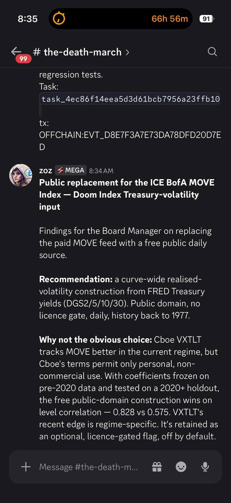

# Public replacement for the ICE BofA MOVE Index

Deliverable for Post Fiat task `task_dfb21d4` — finding a free public daily
replacement for the paid ICE BofA MOVE Index as the Doom Index Treasury-rate
volatility input, converted to a 70–180 range.

**Full deliverable (candidate table, formula, script, out-of-sample validation,
reproducibility snapshots):**
<https://gist.github.com/0xzoz/354f05fba7f979ea04e618e6bded6551>

**Recommendation:** a curve-wide realised-volatility construction from FRED
Treasury yields (DGS2/5/10/30) — public domain, no licence gate. With
coefficients frozen on pre-2020 data and tested on a 2020+ holdout it beats the
licence-gated Cboe VXTLT alternative on level correlation, 0.828 vs 0.575.

## Announcement evidence

Posted to the Post Fiat Discord `#the-death-march` channel on 2026-08-07:

[Discord message](https://discord.com/channels/1061800464045310053/1229917290254827521/1535310135814267001)

SHA-256 of screenshot: `8685ab72e86c14da1743777a6b4120c766a836986b18846439382e179dedd33e`

No trades or investment advice.
